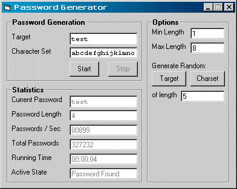



## Faster Password Generation

### Description

This is a "password generator" that can (on my puny PII 333mHz computer) generate about 40000-80000 passwords per second (number varies based on password length).

This project was inspired by this Planet-Source-Code post:

"Fast BruteForce Class Example" by §e7eN.

http://www.Planet-Source-Code.com/vb/scripts/ShowCode.asp?txtCodeId=48276&lngWId=1

and by various websites, code snippets, and newsgroup posts.

I have no interest/knowledge in using this to break into anything or do any harm. I'm do love the logic behind such challenges. Though, I'm sure I'm at the pre-k level when it comes to serious string manipulation.
 
### More Info
 

             |
---                |---
**Submitted On**   |2003-09-26 21:02:56
**By**             |[redbird77](https://github.com/Planet-Source-Code/PSCIndex/blob/master/ByAuthor/redbird77.md)
**Level**          |Intermediate
**User Rating**    |5.0 (15 globes from 3 users)
**Compatibility**  |VB 5\.0, VB 6\.0
**Category**       |[String Manipulation](https://github.com/Planet-Source-Code/PSCIndex/blob/master/ByCategory/string-manipulation__1-5.md)
**World**          |[Visual Basic](https://github.com/Planet-Source-Code/PSCIndex/blob/master/ByWorld/visual-basic.md)
**Archive File**   |[Faster\_Pas1650459262003\.zip](https://github.com/Planet-Source-Code/redbird77-faster-password-generation__1-48803/archive/master.zip)

